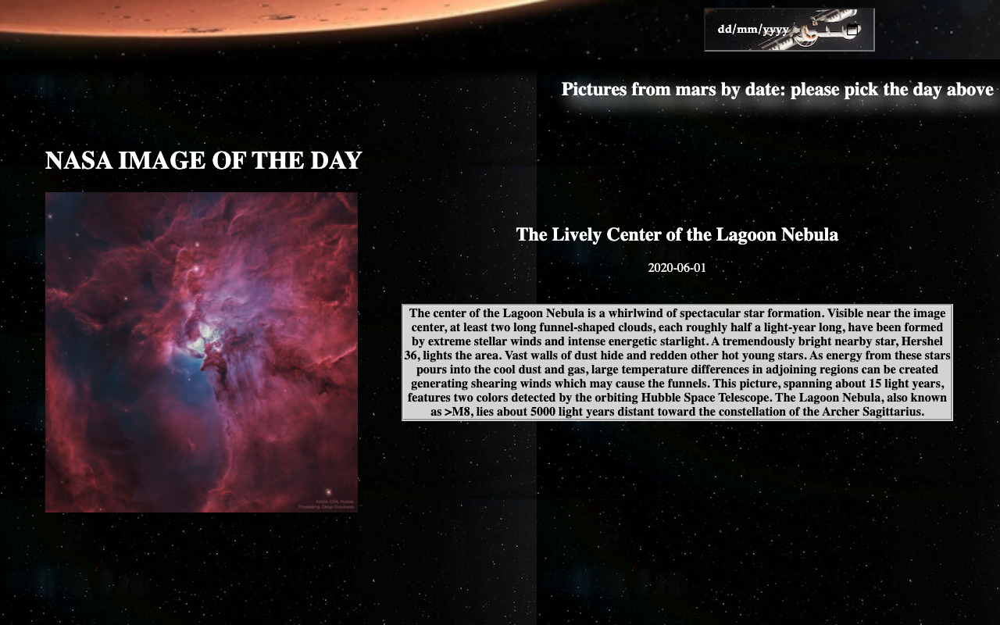

# Nasa Project

### Allows to connect to Nasa's API and display images done by rovers from mars. Pictures are made daily therefore this project allows you to view them by day you choose. Additionaly on the front page there is a section where you can see the picture of the day by nasa.




## Project setup
```
npm install
```

### Compiles and hot-reloads for development
```
npm run serve
```

### Compiles and minifies for production
```
npm run build
```

### Customize configuration
See [Configuration Reference](https://cli.vuejs.org/config/).
